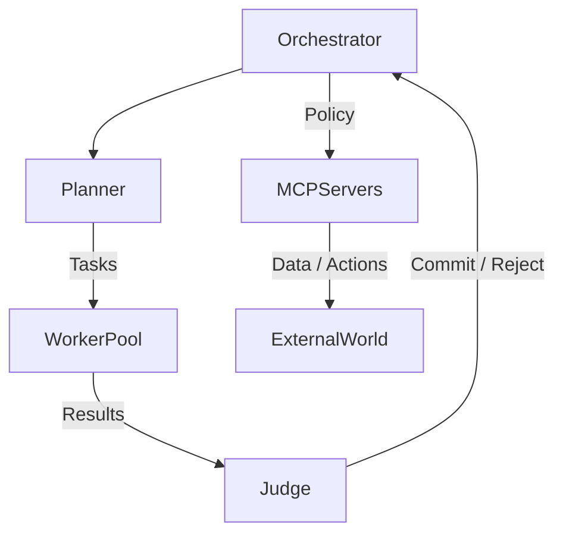
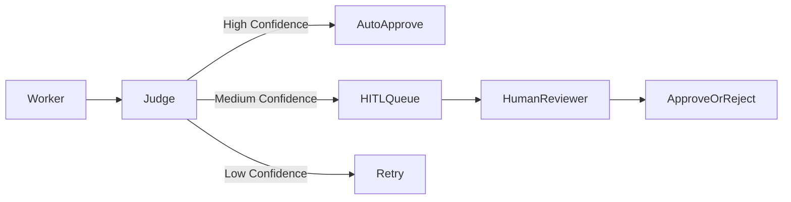

# Architecture Strategy

## Purpose

This document translates **research insights and SRS intent** into a concrete architectural direction for Project Chimera. It answers *how* the system should be structured, *why* specific patterns are chosen, and *where* humans, agents, and infrastructure interact.

This is a **pre-code artifact**. No implementation decisions should contradict this document.

## 1. Architectural Goals (Derived from SRS)

From the Chimera SRS, the architecture must:

1. Support **thousands of autonomous influencer agents** concurrently
2. Enable **goal-directed autonomy**, not scripted automation
3. Enforce **governance, safety, and budget control**
4. Decouple agent cognition from external platforms
5. Allow a **single human operator** to manage the system (Management by Exception)

These goals eliminate monolithic-agent and ad-hoc prompt architectures.

## 2. Chosen Agent Pattern

### 2.1 Pattern Selected: **Hierarchical Swarm (Planner–Worker–Judge)**

#### Why This Pattern

| Requirement     | Reason Planner–Worker–Judge Fits      |
| --------------- | ------------------------------------- |
| Scalability     | Workers scale horizontally, stateless |
| Quality Control | Judges enforce acceptance criteria    |
| Adaptability    | Planners dynamically re-plan          |
| Fault Isolation | Worker failure does not cascade       |
| Governance      | Judge is a natural safety gate        |

This pattern directly aligns with:

* FastRender Swarm Architecture (SRS §3.1)
* Management-by-exception philosophy
* Real-world constraints of LLM unreliability

#### Rejected Patterns

* **Single Autonomous Agent** – brittle, ungovernable
* **Sequential Chain-of-Thought Pipelines** – low parallelism
* **Peer-to-Peer Agent Mesh** – high coordination complexity

## 3. High-Level System Topology

### 3.1 Hub-and-Spoke Model

* **Central Orchestrator (Hub)**

  * Maintains global state
  * Enforces policy and budgets
  * Hosts dashboard and HITL queues

* **Agent Swarms (Spokes)**

  * Planner service
  * Worker pool
  * Judge service

All external interactions flow **only through MCP servers**.

## 4. Human-in-the-Loop (HITL) Strategy

### 4.1 HITL Insertion Points

Humans do **not** approve everything. They intervene only when:

1. Judge confidence score is below threshold
2. Content is flagged as sensitive (politics, health, finance)
3. Financial actions exceed budget norms

### 4.2 HITL Flow

This preserves velocity while maintaining accountability.

## 5. Data Architecture Decisions

### 5.1 Storage Types and Rationale

| Data Type               | Storage              | Rationale                        |
| ----------------------- | -------------------- | -------------------------------- |
| Agent memory (semantic) | Weaviate (Vector DB) | Long-term recall, RAG            |
| Tasks & state           | PostgreSQL           | Strong consistency, audit trails |
| Short-term context      | Redis                | Low latency, ephemeral           |
| Financial ledger        | Blockchain           | Immutable, auditable             |

### 5.2 Why Not a Single Database

* Mixing semantic and transactional data creates scaling conflicts
* Vector search requires different indexing strategies
* Financial data demands immutability

Separation enforces correctness.

## 6. Inter-Agent & External Communication

### 6.1 Internal Communication

* Agents **do not message each other directly**
* All coordination flows through:

  * Task queues
  * Global state
  * Planner decisions

This avoids emergent chaos.

### 6.2 External Communication

* All external systems accessed via **MCP Servers**
* Agents are unaware of:

  * API keys
  * Platform quirks
  * Vendor-specific logic

This enables hot-swapping platforms without rewriting agent logic.

## 7. Security & Governance Considerations

### 7.1 Key Principles

* Least privilege per agent
* No direct API credentials inside agent logic
* Budget enforcement before action execution

### 7.2 Governance Layers

| Layer        | Responsibility          |
| ------------ | ----------------------- |
| Specs        | Define allowed behavior |
| Tests        | Enforce contracts       |
| Judge Agents | Runtime enforcement     |
| CI/CD        | Prevent bad merges      |
| HITL         | Final human authority   |

## 8. Architectural Risks & Mitigations

| Risk                 | Mitigation                  |
| -------------------- | --------------------------- |
| Agent drift          | Centralized persona + specs |
| Cost runaway         | CFO Judge + budgets         |
| Platform API changes | MCP abstraction             |
| LLM hallucination    | TDD + Judge validation      |
| Human overload       | Management by exception     |

## 9. Conclusion

This architecture positions Project Chimera as:

* A **governed agent factory**, not a prompt system
* Compatible with emerging **agent social networks**
* Scalable by design, safe by default

With this strategy locked, implementation can proceed **without ambiguity**.

